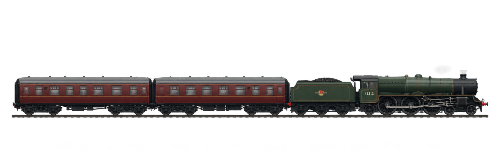

  

<h1 align="center">Gabriel</h1>

  Data scientist and ML engineer in São Paulo, working remotely.

 

Most of my time goes into taking messy data through training and evaluation until it becomes a system someone can run. A model that has not cleared that bar does not ship.

## Now

**Aegis** is an experimental platform for studying how autonomous aerial agents perceive, coordinate, and adapt as a group.

It is built for research on multi-agent autonomy and perception. The simulation already runs deterministic swarm coordination and controlled perception experiments. Real-world YOLO behavior is still being characterized so its effect on the swarm can be measured with some care.

## Work

- Models with explicit entry and exit criteria
- Data pipelines another person can inherit
- Evaluation before deploy
- Supporting tools when the model alone is not the whole product

`Python` · `SQL` · `PyTorch` · `scikit-learn` · `experiment design` · `model evaluation`

## Contact

São Paulo, Brazil · Remote

[ email ] · [ site ]
